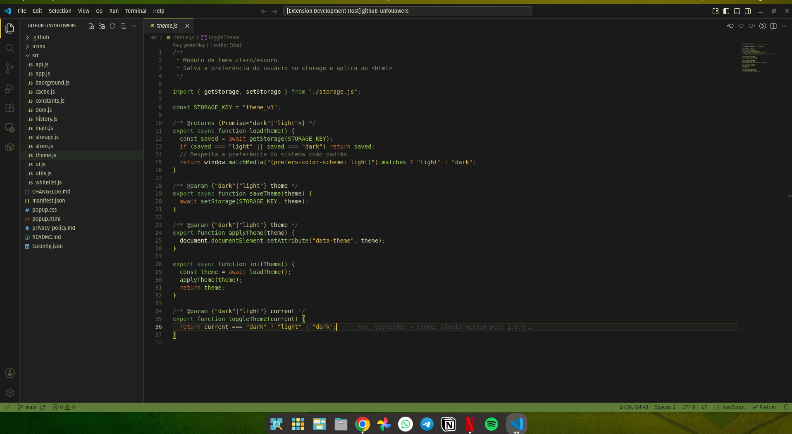

  

  O clima da Copa do Mundo agora faz parte do seu editor.

---

## Entre em campo

Cada Copa do Mundo tem sua identidade: gramados, estádios, bandeiras, torcidas e as cores que ficam marcadas na memória.

leve essa atmosfera para o Visual Studio Code com **Brasil Copa**. Tons de verde profundo, dourado e amarelo transformam o editor em um ambiente que lembra o maior torneio do futebol mundial.

Seja acompanhando uma partida, desenvolvendo durante a competição ou simplesmente vivendo o clima da Copa, este tema foi criado para quem quer carregar um pouco dessa experiência para o dia a dia.

  

## Contribuindo

Sugestões e melhorias são sempre bem-vindas.

Abra uma **Issue** ou envie um **Pull Request**:

**https://github.com/joaomjbraga/brasil-copa**

---

## Licença

Este projeto está licenciado sob a licença MIT.
